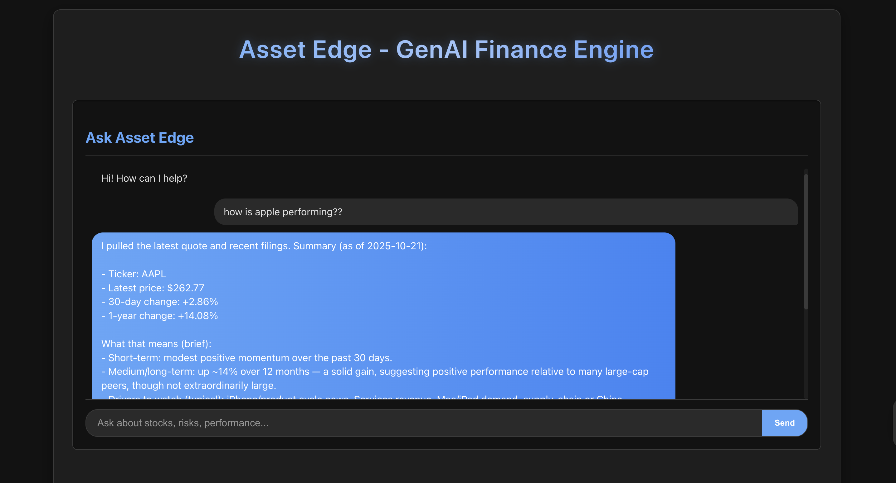
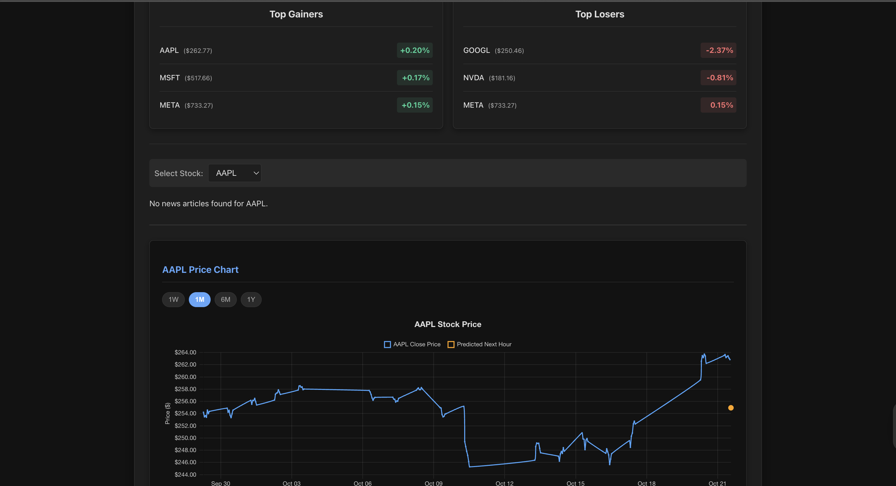

# Asset Edge - GenAI Finance Engine 📈🤖


## Overview

Asset Edge is a full-stack web application designed to provide financial insights using AI. It leverages Large Language Models (LLMs) combined with real-time and historical financial data (SEC filings, stock prices, news) to answer user queries, display market trends, and offer predictive analytics. This project showcases skills in data engineering, machine learning (time-series forecasting with LSTMs), backend development (FastAPI), frontend development (React), and RAG (Retrieval-Augmented Generation) systems.


## Features ✨

* **AI Chat Interface:** Ask complex financial questions about supported stocks (e.g., "What are META's biggest risks?", "How has AAPL stock performed recently?"). The agent uses RAG to pull context from SEC filings and news, alongside real-time stock performance data.
* **Stock Charts:** View interactive stock price charts (1W, 1M, 6M, 1Y) for selected tickers, including an LSTM-based prediction for the next hour.
* **Market Movers:** Displays the top 3 daily gainers and losers from the tracked ticker list.
* **Relevant News:** Shows recent news articles related to the selected ticker.





## Tech Stack 🛠️

* **Backend:** Python, FastAPI
* **Frontend:** React, JavaScript, CSS, Chart.js (`react-chartjs-2`)
* **AI/ML:**
    * LangChain (Agents, RAG)
    * OpenAI API (`gpt-5-mini` or other)
    * PyTorch (LSTM for time-series forecasting)
    * Sentence-Transformers (Embeddings)
    * Transformers (Hugging Face pipeline for sentiment)
* **Database:** ChromaDB (Vector Store)
* **Data Sources:** SEC EDGAR, yfinance, NewsAPI
* **Core Libraries:** Pandas, NumPy, Scikit-learn, Requests, BeautifulSoup4

## Setup Instructions ⚙️

1.  **Clone Repository:**
    ```bash
    git clone [https://github.com/fxliped/GenAI-Finance-Engine.git](https://github.com/fxliped/GenAI-Finance-Engine.git)
    cd GenAI-Finance-Engine
    ```

2.  **Backend Setup (Python):**
    * **Install Python:** Ensure you have Python 3.11 installed.
    * **Create Virtual Environment:**
        ```bash
        python3.11 -m venv venv
        source venv/bin/activate
        ```
    * **Install Dependencies:**
        ```bash
        pip install -r requirements.txt
        ```
    * **API Keys:** Create a `.env` file in the project root and add your keys:
        ```dotenv
        OPENAI_API_KEY=sk-YourOpenAIKey...
        NEWS_API_KEY=YourNewsApiKey...
        ```
    * **(IMPORTANT) Verify OpenAI Organization:** Ensure your OpenAI organization is verified for the model you are using (e.g., `gpt-5-mini`), especially if encountering streaming errors. See [OpenAI Org Settings](https://platform.openai.com/settings/organization/general).

3.  **Frontend Setup (React):**
    * **Navigate to Frontend:**
        ```bash
        cd ../asset-edge-frontend
        # Or `cd asset-edge-frontend` if it's inside the main repo
        ```
    * **Install Dependencies:**
        ```bash
        npm install
        ```

## Generating Data & Models 💾

*(Note: These scripts download significant amounts of data and can take a long time to run. Ensure you have sufficient disk space and respect API rate limits.)*

1.  **Download Raw Data:** Run the download script (ensure `venv` is active). This fetches SEC filings, stock history, and news.
    ```bash
    # From the GenAI-Finance-Engine directory
    source venv/bin/activate
    python download_data.py
    ```

2.  **Process Data & Build Vector DB:** Run the processing script. This parses filings/news, creates embeddings, builds the ChromaDB, and generates sentiment CSVs.
    ```bash
    # From the GenAI-Finance-Engine directory (venv active)
    python process_data.py
    ```

3.  **Train LSTM Models:** Run the training script. This trains a model for each ticker and saves it.
    ```bash
    # From the GenAI-Finance-Engine directory (venv active)
    python train_lstm.py
    ```

## Running the Application 🚀

1.  **Start Backend Server:**
    ```bash
    # From the GenAI-Finance-Engine directory
    source venv/bin/activate
    # Make sure .env file is present
    python main.py
    # Or for development with auto-reload: uvicorn main:app --reload
    ```
    *(The API will be available at `http://127.0.0.1:8000`)*

2.  **Start Frontend Server:**
    ```bash
    # From the asset-edge-frontend directory
    npm start
    ```
    *(The React app will open automatically at `http://localhost:3000`)*

## Usage

* Use the chat interface to ask questions about the supported stocks.
* Select different tickers using the dropdown to view their specific news and price charts.
* Use the chart time range buttons (1W, 1M, etc.) to adjust the view.

## Future Work / Roadmap 🗺️

* Implement user accounts and personalized watchlists.
* Deploy backend and frontend to a cloud platform (e.g., AWS).
* Switch to a cloud-based vector database for scalability.
* Integrate more data sources (e.g., social media sentiment, analyst ratings).
* Refine LSTM model architecture and feature engineering.
* Build BI dashboards using Snowflake and Tableau (Phase 4).
* Develop a mobile app using React Native.

---